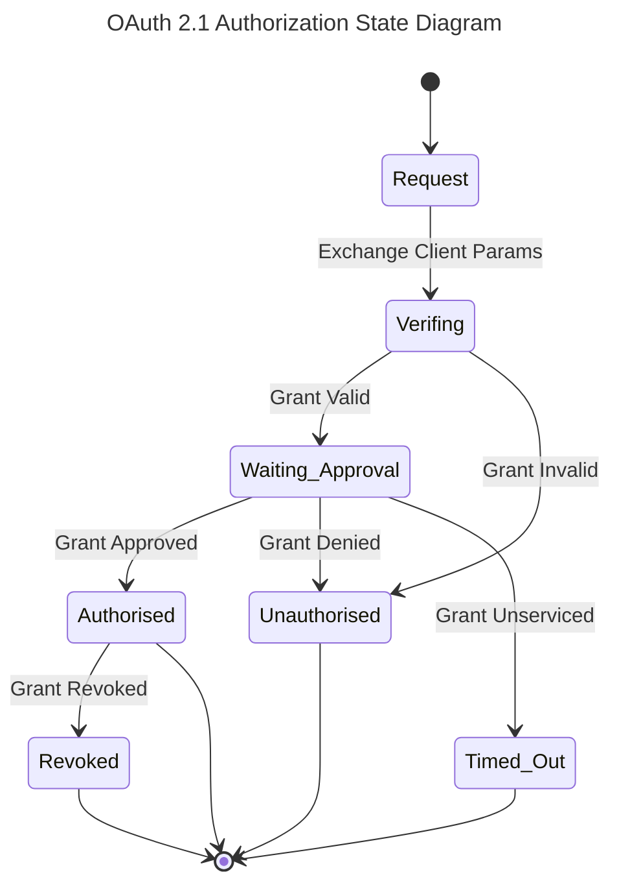

```mermaid
---
title: OAuth 2.1 Authorization State Diagram
---
stateDiagram-v2
	[*] --> Request
	Request --> Verifing: Exchange Client Params
	Verifing --> Waiting_Approval: Grant Valid
	Verifing --> Unauthorised: Grant Invalid
	Waiting_Approval --> Authorised: Grant Approved
	Waiting_Approval --> Unauthorised: Grant Denied
	Waiting_Approval --> Timed_Out: Grant Unserviced
	Authorised --> Revoked: Grant Revoked
	Revoked --> [*]
	Timed_Out --> [*]
	Unauthorised --> [*]
	Authorised --> [*]
```
*Built for [erlaubnis](https://github.com/errbufferoverfl/erlaubnis).*