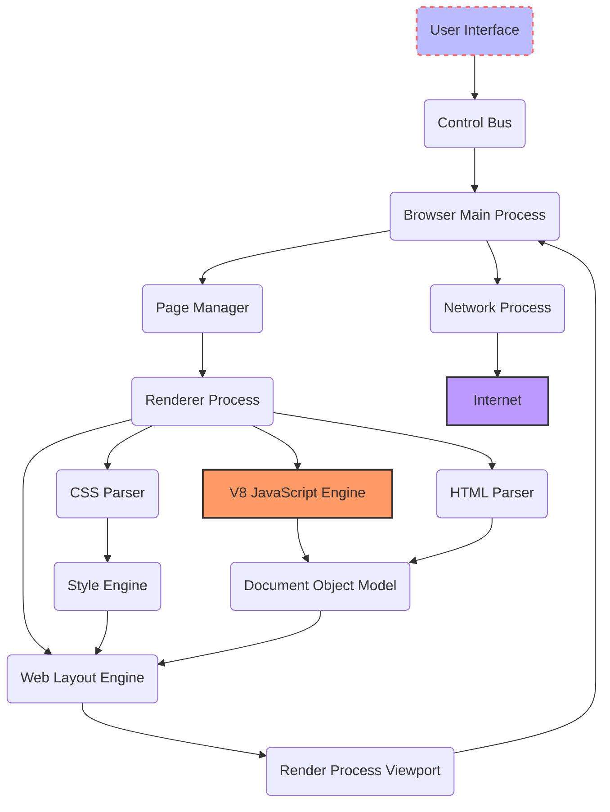
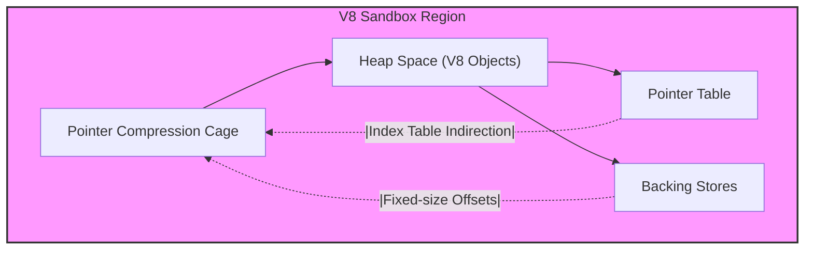
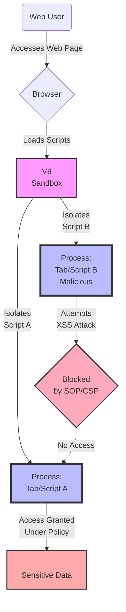

## Browser Architecture Overview

There are several key components that makeup the modern browser:

- **User Interface**: Includes browser elements like the address bar, navigation buttons, and bookmarks. User commands and interactions are managed here.
- **Control Bus**: Serves as a communication hub within the browser, routing data and commands between components.
- **Browser Main Process**: The central process coordinating various browser tasks, including managing tabs, extensions, and overall browser functionality.
- **Page Manager**: Handles page lifecycle events and coordinates the loading of web content.
- **Renderer Process**: Dedicated to parsing HTML, executing JavaScript via the V8 engine, applying CSS styles, and constructing the layout of the web page. Modern browsers use multiple renderer processes for different tabs to enhance security and stability.
- **V8 JavaScript Engine**: Responsible for parsing, compiling, and executing JavaScript code. This high-performance engine plays a critical role in the dynamic behavior of web pages.
- **HTML/CSS Parser**: These components parse HTML markup and CSS styles, respectively, turning them into structures the browser can work with.
- **Document Object Model (DOM)**: Represents the page structure, allowing JavaScript (via V8) to interactively modify content and styles.
- **Style Engine & Web Layout Engine**: The style engine applies CSS rules to elements, while the layout engine calculates the geometry and position of elements, ultimately painting the web page on the screen.
- **Render Process Viewport**: The part of the renderer process that displays the processed content to the user.
- **Network Process**: Handles network operations like fetching resources from the internet, isolated from direct execution within the renderer processes for security.

In April 2024, the V8 project [announced](https://v8.dev/blog/sandbox) after three years the in-process sandbox for V8 was no longer considered an experimental security feature and added the sandbox to Chrome's [Vulnerability Reward Program](https://g.co/chrome/vrp/#v8-sandbox-bypass-rewards).

The V8 sandbox serves as a critical security layer within the V8 JavaScript engine, which is utilized by Google Chrome and Node.js, among other software. Its core purpose is to securely execute untrusted JavaScript code, minimizing the potential for malicious scripts to compromise the host system's integrity or user data. By isolating the execution of JavaScript from the system's native processes and resources, the V8 sandbox aims to ensure that any harmful actions attempted by the JavaScript code are contained within the sandbox, thereby significantly reducing the risk of security breaches.

## About the V8 High-Level Design Doc

The [V8 sandbox high-level design doc](https://docs.google.com/document/d/1FM4fQmIhEqPG8uGp5o9A-mnPB5BOeScZYpkHjo0KKA8/edit?usp=sharing) seeks to counteract the threat posed by an attacker capable of corrupting memory within the V8 heap—where JavaScript objects reside. It does so by:

1. **Isolating the V8 Heap**: The V8 heap is moved to a pre-reserved region of the virtual address space, known as the sandbox. This confined space aims to limit the attacker's ability to corrupt memory outside the sandbox.
2. **Restricting Memory Access**: Memory accesses performed by V8 are either constrained within the sandbox address space or validated, for instance, through pointer indirection via a pointer table. This design effectively prohibits the use of full raw pointers within the V8 heap.
3. **Pointer Compression**: Utilizing pointer compression, where references within the V8 heap turn into 32-bit offsets from a heap base known as the pointer compression cage. This compresses pointers only to be valid within a predefined memory region, enhancing security.
4. **Sandbox Reservation**: A large virtual address space (e.g., 1TB) is designated as the sandbox during V8's initialization. This space houses not only the V8 heaps but also other objects like ArrayBuffer backing stores, all referenced using fixed-size offsets or via a pointer table to maintain integrity and avoid external heap corruption.

## Before V8 Sandboxing

1. **Tighter Integration with Browser Process**: Initially, V8 was more tightly integrated with the browser's main process, executing JavaScript code with relatively more direct access to system resources and user data.
2. **Higher Risk of Exploitation**: Without the isolation provided by a sandbox, vulnerabilities in the V8 engine—such as memory corruption bugs—could potentially be exploited to execute arbitrary code or access sensitive information directly, impacting the broader application or system.
3. **Complex Security Layers**: Security relied more heavily on code correctness and additional layers of security outside of V8 itself. While effective to a degree, this approach left less room for error and demanded rigorous security audits and immediate patching of discovered vulnerabilities.

## Threat Model of the V8 Sandbox

The threat model for the V8 sandbox considers various attack vectors that might be employed to bypass sandbox restrictions or exploit vulnerabilities within the JavaScript engine itself, including:

- **Remote Code Execution (RCE)**: An attacker might seek to execute arbitrary code on the user's machine by exploiting flaws in the JavaScript engine's interpretation or execution of script code.
- **Data Exfiltration**: This involves attempts to access and illicitly transmit sensitive information from the host system by leveraging JavaScript executed within the context of the sandbox.
- **Denial of Service (DoS)**: Exploiting the JavaScript engine to consume excessive system resources, leading to application or system instability.
- **Cross-Site Scripting (XSS)**: Utilizing vulnerabilities in web applications to inject malicious scripts that can be executed within the context of the sandbox, aiming to bypass SOP (Same-Origin Policy) protections.
- **Side-channel Attacks**: Exploiting the sandboxed environment to perform speculative execution attacks (like Spectre) that can indirectly infer and leak information across process boundaries.

## Historic Vulnerability Classes Affecting the Engine

Here’s a look into the types of exploits that have historically affected V8 and similar engines, though specific instances might vary over time:

- **Memory Corruption Vulnerabilities**: These have been common, where attackers exploit flaws in the engine’s memory management to execute arbitrary code. For instance, improper handling of objects in memory or issues with garbage collection can lead to out-of-bounds access, use-after-free, or buffer overflow vulnerabilities.
- **Type Confusion Errors**: Type confusion occurs when the engine performs an operation on an object of one type while incorrectly assuming it is a different type. This can allow attackers to manipulate the memory layout of objects, potentially leading to code execution.
- **Just-In-Time (JIT) Compiler Bugs**: The JIT compiler, which compiles JavaScript to native code at runtime for performance, can have vulnerabilities that might be exploited to execute arbitrary code or bypass security measures.
- **Side-Channel Attacks (e.g., Spectre and Meltdown)**: While not exclusive to V8, these hardware-level vulnerabilities have significant implications for JavaScript engines. By exploiting speculative execution in CPUs, attackers can leak sensitive information across isolation boundaries in browsers.
- **Logic Bugs Leading to Sandbox Escapes**: Exploits might also target the logic of the sandbox itself, seeking ways to escape its constraints and gain broader access to system resources or sensitive information.

## Security Model of the V8 Sandbox

To counter the threats identified, the V8 sandbox implements several security principles and mechanisms:

- **Process Isolation**: Running JavaScript execution in a separate process from the browser's main process, thereby limiting the consequences of potential vulnerabilities exploitation to the isolated process.
- **Restricted API Access**: Ensuring the sandboxed code has minimal and strictly controlled access to system APIs and resources, blocking direct filesystem access, network operations, or other sensitive operations unless explicitly allowed through secure interfaces.
- **Memory Protection**: Implementing safeguards to prevent arbitrary memory access by sandboxed code, using techniques like address space layout randomization (ASLR) and non-executable memory regions to mitigate RCE and buffer overflow attacks.
- **Integrity Checks**: Employing signature verifications, code audits, and runtime monitoring to detect and prevent unauthorized modifications to sandboxed code or attempts to break out of the sandbox environment.
- **Cross-Origin Resource Policies**: Integrating with browser-level security policies like CORS, COOP, and COEP to control cross-origin interactions and enhance the security of web applications relying on JavaScript execution.

## After V8 Sandboxing

1. **Process Isolation**: The sandboxed V8 engine runs JavaScript code in isolated processes, separate from the main browser process. This isolation enhances security by limiting the potential damage that can be done if malicious JavaScript code were to exploit a bug within V8.
2. **Restricted Access to System Resources**: Sandboxing provides strict control over what system resources and user data the JavaScript code can access. This means even if an attacker successfully exploits a vulnerability within V8, their capacity to cause harm is significantly reduced due to these access restrictions.
3. **Enhanced Security and Stability**: By isolating V8 in its own sandbox, browsers and applications using V8 can achieve greater stability and security. If the V8 process encounters an issue or crashes, it doesn't necessarily compromise the stability or security of the entire application.
4. **Granular Permission Controls**: The sandbox model allows for more granular permission controls over web content, helping to enforce a minimum privilege principle where JavaScript code is only allowed the minimum level of access needed to function.
5. **Increased Resource Use**: A notable trade-off of sandboxing is the potential increase in memory and CPU usage due to the overhead associated with running multiple isolated processes. However, the benefits in terms of security and robustness generally outweigh these performance costs.
6. **Mitigation against Sophisticated Attacks**: The sandbox architecture inherently mitigates against a wider range of attack vectors, including those that rely on exploiting the JavaScript engine to execute side-channel attacks like Spectre.

## V8 Sandbox Architecture

The V8 sandbox architecture revolves around process isolation, restricted APIs access, and controlled interaction with the host environment. It ensures that JavaScript execution within the engine remains within the confines of strict security boundaries. Here's how it's architected:

- **Main Browser Process**: Manages user interface, input, and orchestrates the overall operation of the browser, including the spawning of separate processes for different tasks.
- **Renderer Process**: Handles the rendering of web pages and the execution of JavaScript code. Each renderer process is isolated from others, enhancing security and stability.
- **V8 Engine Instance**: Each renderer process contains an instance of the V8 engine, responsible for compiling and executing JavaScript code. The sandboxing within this context ensures that JavaScript execution can't directly access system resources or user data.
- **API Layer**: A set of controlled interfaces that JavaScript code running within the V8 engine can access. This layer mediates access to system resources, applying strict security checks.
- **Sandbox Layer**: The core component that enforces restrictions on JavaScript execution, including memory access controls, execution flow restrictions, and API access limitations.
- **System Resources**: Includes the filesystem, network, and other OS-level resources. Access to these resources from the V8 engine is heavily restricted and monitored.

### Key Architectural Features

- **Isolation**: By running the renderer processes independently, V8 ensures that no single process can directly impact another, significantly reducing the blast radius of any potential exploit.
- **Controlled API Access**: The API layer underpins the sandbox's security model, allowing JavaScript code execution while preventing unauthorized system resource access.
- **Sandbox Layer Enforcement**: At the heart of the architecture, the sandbox layer applies stringent control over what actions JavaScript code can perform, heavily guarding against attempts to escape the sandbox or perform malicious actions.

## How Does Memory Isolation Work in the Sandbox?

- **Structured Heap Allocation**: V8 structures its heap in a specific manner, distinguishing between various types of data and allocating them in separate segments. By compartmentalizing different data types (e.g., executable code, object data, and strings) into different areas of the heap, V8 minimizes the risk that a corruption in one area will affect others.
- **Pointer Tagging**: V8 employs techniques like pointer tagging, where pointers (references to memory locations) are manipulated in such a way that they include additional information about the type of data they point to. This makes it more difficult for an attacker to forge pointers or manipulate memory in unintended ways because the engine will validate the tagged information before accessing memory locations.
- **Guard Pages and Memory Randomization**: To prevent "overflow" attacks from reaching critical parts of the memory, V8 can use guard pages—non-accessible pages of memory placed between memory segments. Additionally, address space layout randomization (ASLR) is used to randomize the memory locations of heap allocations, making it significantly harder for attackers to predict where their payloads might be placed or how to reach sensitive parts of memory.
- **Sandboxing & Process Isolation**: Beyond heap isolation, V8 runs in a sandboxed environment within the browser, often as part of a renderer process that is separate from the main browser process and other tabs. This further contains the impact of any heap corruption, as the sandbox restricts the process's access to system resources and other process memories.
- **Write Barriers and Integrity Checks**: V8 uses write barriers and other runtime checks to maintain the integrity of the heap. Write barriers are mechanisms that enforce rules about how references between objects can be established or updated, ensuring that certain security invariants are maintained even when objects are written to the heap.

## What Does Sandboxing V8 Change?

Sandboxing the V8 JavaScript engine has had a profound impact on modern browsers, enhancing security, stability, and even influencing web application development practices. Here’s how these impacts break down:

**Enhanced Security**

- **Isolated Execution Environment**: Sandboxing isolates the execution of JavaScript code from the rest of the browser and the underlying operating system. This isolation significantly reduces the risk of malicious scripts exploiting a vulnerability in the V8 engine to gain access to sensitive data or system resources.
- **Mitigation of Exploits**: By limiting what JavaScript execution can access, the potential damage from vulnerabilities like buffer overflows or type confusions is contained within the sandbox. This makes it much harder for attackers to exploit such vulnerabilities to carry out attacks such as remote code execution.
- **Protection Against Web-Based Threats**: Sandboxing is particularly effective against cross-site scripting (XSS) and injection attacks, where malicious scripts on a webpage attempt to execute unauthorized code. The sandboxed V8 engine ensures these scripts are confined, preventing them from accessing cookies, session tokens, or other sensitive information from the browser.

**Increased Stability**

- **Crash Protection**: In a sandboxed architecture, issues or crashes within the V8 engine are contained within the isolated process. This means that a crash in one tab or JavaScript execution context doesn’t bring down the entire browser, enhancing overall stability.
- **Process Recovery**: Modern browsers can monitor sandboxed processes for problems and automatically restart them if necessary, improving the resilience of the browser against buggy or malicious scripts.

**Performance Considerations**

- **Resource Overhead**: Running multiple isolated instances of the V8 engine in separate processes can increase memory and CPU usage. However, browser developers continuously optimize sandboxing implementations to balance security with performance.
- **Parallel Processing**: The separation enabled by sandboxing also allows browsers to better utilize multi-core processors, running JavaScript executions in parallel across different cores, which can improve the performance of web applications.

## Enforcement of Security Policies

Sandboxed V8 integrates closely with broader browser security mechanisms like the Same-Origin Policy (SOP) and Content Security Policy (CSP). These policies prevent malicious scripts from loading resources from or interacting with domains other than their origin, further reducing the risk of XSS attacks. By enforcing these policies at the sandbox level, V8 ensures that malicious scripts are unable to access or leak sensitive information across origins.

- **Browser Block**: Represents the user accessing a web page through their browser, initiating the script loading process.
- **V8 Sandbox**: Symbolizes the key action where the browser, utilizing the V8 sandbox, loads and executes the JavaScript scripts. Here, the diagram specifically denotes the sandbox as a crucial intermediary that enforces isolation.
- **Script Isolation**: Shows how the sandbox isolates both legitimate (Script A) and malicious (Script B) scripts into separate processes, emphasizing the individual containment of each script.
- **Blocked by SOP/CSP Block**: Illustrates the attempt by Script B (Malicious) to perform an XSS attack on Script A. This action is blocked due to the enforcement of Same-Origin Policy (SOP) and Content Security Policy (CSP), represented by the "Blocked by SOP/CSP" decision node.
- **Sensitive Data Access**: Clarifies that Script A, functioning under established security policies, may have controlled access to sensitive data, whereas Script B's attempts to access or manipulate Script A or sensitive data are thwarted by SOP/CSP, showcasing the effectiveness of sandboxing and security policies in preventing cross-site scripting and injection attacks.

